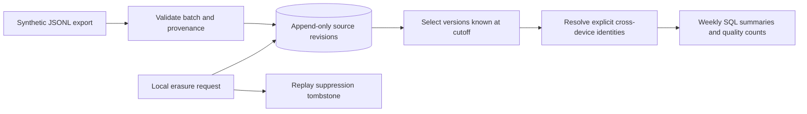

# Fitness Data Platform

A local, synthetic data-engineering project for reliable workout history and weekly summaries. **Local ingestion and incremental SQL milestones are implemented and tested.** This is not a completed cloud product, HealthKit integration, or medical recommendation system.

## Run now

Requires Python 3.11+ with IANA timezone data. The verified local baseline uses only the standard library and SQLite; there are no package downloads or paid API calls required.

```bash
python3 -m unittest discover -s tests -v
python3 -m fitness.demo
python3 -m fitness.incremental_demo
python3 -m fitness --database fitness.db ingest fixtures/baseline.jsonl
python3 -m fitness --database fitness.db summarize --as-of 2026-12-31T23:59:59Z
```

The ordinary ingestion command records the actual receipt time; choose a summary cutoff after that time to see the records. The deterministic demo replays an explicitly synthetic historical timeline in a temporary database and removes it afterward. It does not read real health exports.

## Implemented evidence

- 24 passing tests, including conflict rollback and injected summary-write failure/recovery.
- Source revisions are appended atomically; identical exports replay without duplicate totals.
- A correction changes the current result without overwriting the historical revision.
- Event time, source availability and local receipt time are separate. Historical selection filters knowledge timestamps before selecting the latest revision.
- Distances normalize to metres; durations use UTC elapsed time across daylight-saving changes. Week assignment uses the session's IANA local timezone.
- Only explicitly shared session identities deduplicate devices. Unlinked overlapping workouts remain visible and are counted in an overlap-quality signal.
- Missing distances stay null and missing days stay unknown. Weekly summaries include observation counts.
- Local logical deletion removes revisions and summaries, then blocks reintroduction from old exports.

[Incremental verification](artifacts/incremental-report.json) · [Demo report](artifacts/demo-report.json) · [Test results](artifacts/test-results.txt) · [Data contract](docs/DATA-CONTRACT.md) · [Delivery plan](docs/DELIVERY-PLAN.md)



## Important modelling choices

The full-refresh mart is the correctness baseline. The incremental path compares current canonical sessions with a persisted snapshot, replaces affected user/week/activity groups, and commits its snapshot and cutoff in the same transaction. Corrections moving weeks rebuild both old and new groups. Unchanged replay recomputes zero groups. Source history is still scanned and snapshots copied; this is not a scale or performance claim. Cutoff metadata updates every mart row. Incremental cutoffs cannot move backward; use full refresh for an older historical view. This single-process demo does not serve concurrent snapshots.

Manual records win over watch records, which win over phone records, only when the user and canonical session ID agree. Different IDs never merge merely because timestamps overlap. Whole workout duration is assigned to its start day and week; cross-midnight splitting is not implemented.

Erasure is logical within the live database, not forensic disk sanitization. Hash tombstones retain replay-suppression metadata. External files, exported reports and backups require a separate retention/erasure design before real health data is introduced.

## Next gates

1. Run these same fixtures through real dbt models and tests, preserving the SQL baseline results.
2. Port the now-verified affected-week replacement to the actual dbt adapter, retaining full-refresh parity tests.
3. Run Airflow interval/retry/backfill and freshness-alert exercises.
4. Verify Docker and hosted CI, then authenticated summary delivery and budgeted cloud operations.

Package installation failed in this session because the restricted environment could not resolve PyPI. **dbt and Airflow are not installed or verified here.** The [official dbt-duckdb adapter](https://github.com/duckdb/dbt-duckdb) is the planned local transformation runtime once dependencies are available. No cloud resources were created. CI and Docker definitions are supplied but have not run.

For the incremental command, use `python3 -m fitness --database fitness.db summarize --as-of 2030-01-01T00:00:00Z --incremental`. Local deletion also removes the subject from the incremental snapshot. Snapshot, aggregates and watermark roll back together on failure.
