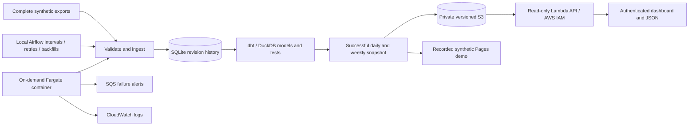

# Architecture and modelling decisions

Source revision grain is user/source/event/revision. Canonical session grain is user/session ID; manual wins over watch, then phone, only for explicitly shared identities. Timestamp overlap alone never merges workouts. Weekly grain is user/local Monday/activity; daily presentation grain is user/local date/activity. Whole workouts belong to their local start date.

A source availability cutoff and ingestion receipt cutoff filter history before revision ordering. This prevents a later revision from hiding an earlier version in a historical view. Replays do not change original receipt timestamps. Corrections moving weeks remove obsolete groups as well as rebuilding current groups.

The source export completes transactionally before its heartbeat is published. If the heartbeat write fails, replay remains safe. Heartbeats record completed exports, not physical activity; a successful empty export can still be fresh. The Airflow DAG reads one envelope per interval and orders ingestion before transformation.

Each interval builds into an isolated directory. Only a successful build advances the publication pointer, and historical runs cannot displace a newer cutoff. AWS persists the ingestion database in S3 and publishes immutable run snapshots before updating the latest summary. A conditional S3 lease serializes writers, expires after ten minutes, and uses ETags for takeover/release. A stopped or timed-out worker cannot hold the lease forever. Cloud batches have a bounded dbt subprocess timeout; deployment/verification harnesses also stop tasks on timeout.

The authenticated Lambda only reads the latest S3 summary. Fargate is used for dbt because the adapter requires POSIX semaphores that Lambda does not provide. No patching of dbt's lock internals is required. GitHub Actions deploys only commits with successful CI, assumes a narrowly scoped AWS role using OIDC, tests the container, registers a task definition and runs a smoke batch.

Terraform owns infrastructure configuration. Deployment automation owns image revisions, so Terraform ignores subsequent image changes. Terraform state is encrypted, versioned and locked in S3. This is one AWS account and region, not a multi-region recovery design.
